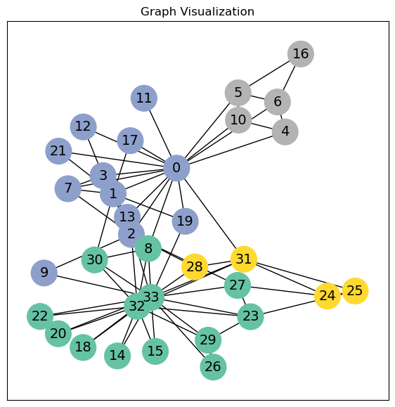

# Introduction: Hands-on Graph Neural Networks

This folder contains the code for the first tutorial in the PyTorch Geometric series, which provides a hands-on introduction to Graph Neural Networks (GNNs).

The link to this Google Colab Notebook for this tutorial is [Introduction: Hands-on Graph Neural Networks](https://colab.research.google.com/drive/1h3-vJGRVloF5zStxL5I0rSy4ZUPNsjy8)

## Tutorial Outputs

The python code output is as follows:

```bash
python main.py
```

```plaintext
Using PyTorch version: 2.0.1+cu117
Using device: cuda
Dataset loaded: KarateClub()
==========================================
Number of graphs in dataset: 1
Number of features per node: 34
Number of classes: 4
==========================================
Graph data: Data(x=[34, 34], edge_index=[2, 156], y=[34], train_mask=[34])
Type of graph data: <class 'torch_geometric.data.data.Data'>
==========================================
Number of nodes: 34
Number of edges: 156
Average node degree: 4.59
Number of training nodes: 4
Training node label rate: 0.12
Does graph have isolated nodes?: False
Does graph have self-loops?: False
Is the graph undirected?: True
==========================================
==========================================
First 20 elements of Edge index tensor: tensor([[ 0,  1],
        [ 0,  2],
        [ 0,  3],
        [ 0,  4],
        [ 0,  5],
        [ 0,  6],
        [ 0,  7],
        [ 0,  8],
        [ 0, 10],
        [ 0, 11],
        [ 0, 12],
        [ 0, 13],
        [ 0, 17],
        [ 0, 19],
        [ 0, 21],
        [ 0, 31],
        [ 1,  0],
        [ 1,  2],
        [ 1,  3],
        [ 1,  7]], device='cuda:0')
Edge index tensor shape: torch.Size([156, 2])
Edge index tensor device: cuda:0
Edge index tensor dtype: torch.int64
==========================================
Graph saved to karate_club_graph.png
===========================================
Model architecture:
GCN(
  (conv1): GCNConv(34, 4)
  (conv2): GCNConv(4, 4)
  (conv3): GCNConv(4, 2)
  (classifier): Linear(in_features=2, out_features=4, bias=True)
)
===========================================
```

A visualization of the graph is found in this image output:



