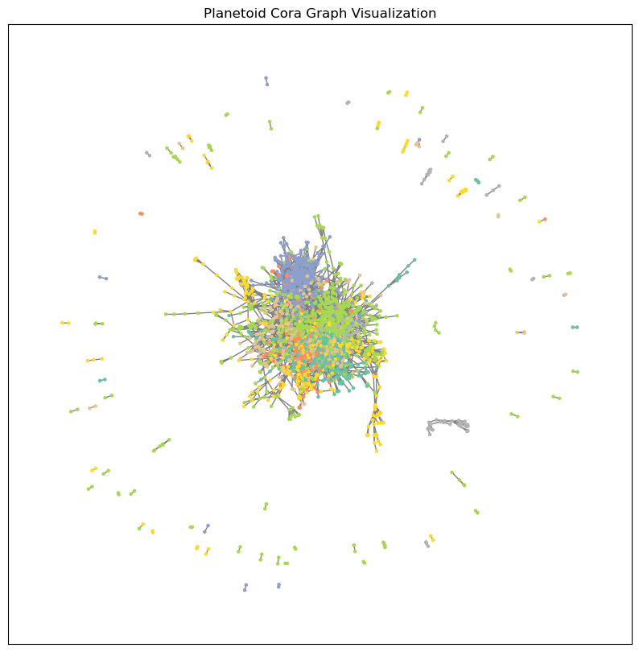
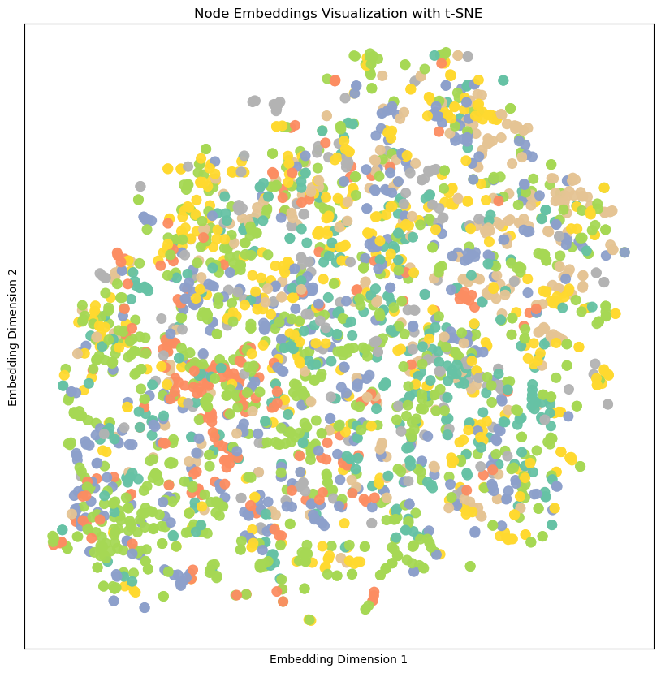

# Node Classification with Graph Neural Networks

This folder contains the code for the second tutorial in the PyTorch Geometric series, which shows how to perform node classification using Graph Neural Networks (GNNs).

The link to this Google Colab Notebook for this tutorial is [Node Classification with Graph Neural Networks](https://colab.research.google.com/drive/14OvFnAXggxB8vM4e8vSURUp1TaKnovzX)

## Tutorial Outputs

The python code output is as follows:

```bash
python main.py
```

```plaintext
Using PyTorch version: 2.0.1+cu117
Using device: cuda
Downloading https://github.com/kimiyoung/planetoid/raw/master/data/ind.cora.x
Downloading https://github.com/kimiyoung/planetoid/raw/master/data/ind.cora.tx
Downloading https://github.com/kimiyoung/planetoid/raw/master/data/ind.cora.allx
Downloading https://github.com/kimiyoung/planetoid/raw/master/data/ind.cora.y
Downloading https://github.com/kimiyoung/planetoid/raw/master/data/ind.cora.ty
Downloading https://github.com/kimiyoung/planetoid/raw/master/data/ind.cora.ally
Downloading https://github.com/kimiyoung/planetoid/raw/master/data/ind.cora.graph
Downloading https://github.com/kimiyoung/planetoid/raw/master/data/ind.cora.test.index
Processing...
Done!
Dataset loaded: Cora()
============ Dataset Information ============
Number of graphs in the dataset: 1
Number of features per node: 1433
Number of classes: 7
=============================================
Graph data: Data(x=[2708, 1433], edge_index=[2, 10556], y=[2708], train_mask=[2708], val_mask=[2708], test_mask=[2708])
Type of graph data: <class 'torch_geometric.data.data.Data'>
===========================================================================================================
Number of nodes in the graph: 2708
Number of edges in the graph: 10556
Average node degree: 3.90
Number of classes: 7
Number of training nodes: 140
Training node label rate: 5.17%
Number of validation nodes: 500
Validation node label rate: 18.46%
Number of test nodes: 1000
Test node label rate: 36.93%
Does graph have isolated nodes?: False
Does graph have self-loops?: False
Is the graph undirected?: True
===========================================================================================================
=============== Edge Index Information ===============
First 20 elements of Edge index tensor: tensor([[ 633,    0],
        [1862,    0],
        [2582,    0],
        [   2,    1],
        [ 652,    1],
        [ 654,    1],
        [   1,    2],
        [ 332,    2],
        [1454,    2],
        [1666,    2],
        [1986,    2],
        [2544,    3],
        [1016,    4],
        [1256,    4],
        [1761,    4],
        [2175,    4],
        [2176,    4],
        [1629,    5],
        [1659,    5],
        [2546,    5]], device='cuda:0')
Edge index tensor shape: torch.Size([10556, 2])
Edge index tensor device: cuda:0
Edge index tensor dtype: torch.int64
======================================================
Graph saved to planetoid_cora_graph.png
============ MLP Model Summary ===========
MLP Model architecture:
MLP(
  (lin1): Linear(in_features=1433, out_features=16, bias=True)
  (lin2): Linear(in_features=16, out_features=7, bias=True)
)
==========================================
============ Loss Function ===========
Loss function: CrossEntropyLoss()
=====================================
============ Optimizer ===========
Optimizer: Adam (
Parameter Group 0
    amsgrad: False
    betas: (0.9, 0.999)
    capturable: False
    differentiable: False
    eps: 1e-08
    foreach: None
    fused: None
    lr: 0.01
    maximize: False
    weight_decay: 0.0005
)
===================================
Number of training epochs: 150
Printing training progress every 25 epochs
======================= Training MLP Model =======================
Training MLP Model for 150 epochs...
Epoch: 001; Training Loss: 1.9610
Epoch: 025; Training Loss: 1.6550
Epoch: 050; Training Loss: 1.1231
Epoch: 075; Training Loss: 0.7026
Epoch: 100; Training Loss: 0.6053
Epoch: 125; Training Loss: 0.6383
Epoch: 150; Training Loss: 0.4885
======================= Testing MLP Model =======================
MLP Model Test Set Accuracy: 0.5830
============ GCN Model Summary ===========
GCN Model architecture:
GCN(
  (conv1): GCNConv(1433, 16)
  (conv2): GCNConv(16, 7)
)
==========================================
============ Visualizing GCN Model Node Embeddings Before Training ===========
Node embeddings visualization saved to GCN_model_node_embeddings_before_training.png
Saved plot of GCN model node embeddings before training to GCN_model_node_embeddings_before_training.png
==============================================
============ Loss Function ===========
Loss function: CrossEntropyLoss()
=====================================
============ Optimizer ===========
Optimizer: Adam (
Parameter Group 0
    amsgrad: False
    betas: (0.9, 0.999)
    capturable: False
    differentiable: False
    eps: 1e-08
    foreach: None
    fused: None
    lr: 0.01
    maximize: False
    weight_decay: 0.0005
)
===================================
Number of training epochs: 150
Printing training progress every 25 epochs
======================= Training GCN Model =======================
Training GCN Model for 150 epochs...
Epoch: 001; Training Loss: 1.9465
Epoch: 025; Training Loss: 1.6765
Epoch: 050; Training Loss: 1.1994
Epoch: 075; Training Loss: 0.7453
Epoch: 100; Training Loss: 0.5580
Epoch: 125; Training Loss: 0.4847
Epoch: 150; Training Loss: 0.4133
======================= Testing GCN Model =======================
GCN Model Test Set Accuracy: 0.8180
============ Visualizing GCN Model Node Embeddings After Training ===========
Node embeddings visualization saved to GCN_model_node_embeddings_after_training.png
Saved plot of GCN model node embeddings after training to GCN_model_node_embeddings_after_training.png
==============================================
```

A visualization of the graph is found in this image output:



### GCN Model Node Embeddings Before Training

Without training, the node embeddings, which are 7-dimensional compressed to 2D using t-SNE, are scattered randomly in 
the projected space.

A visualization of the initial node embeddings before training is found in this image output.
Note that the colors correspond to the true node classes, which are not known to the model before training.



### GCN Model Node Embeddings After Training

After training, the output node embeddings of the trained GCN model produce far superior clustering of nodes of the same
class in the projected space, indicating that the model has learned to separate nodes based on their classes.

A visualization of the final node embeddings after training is found in this image output.


